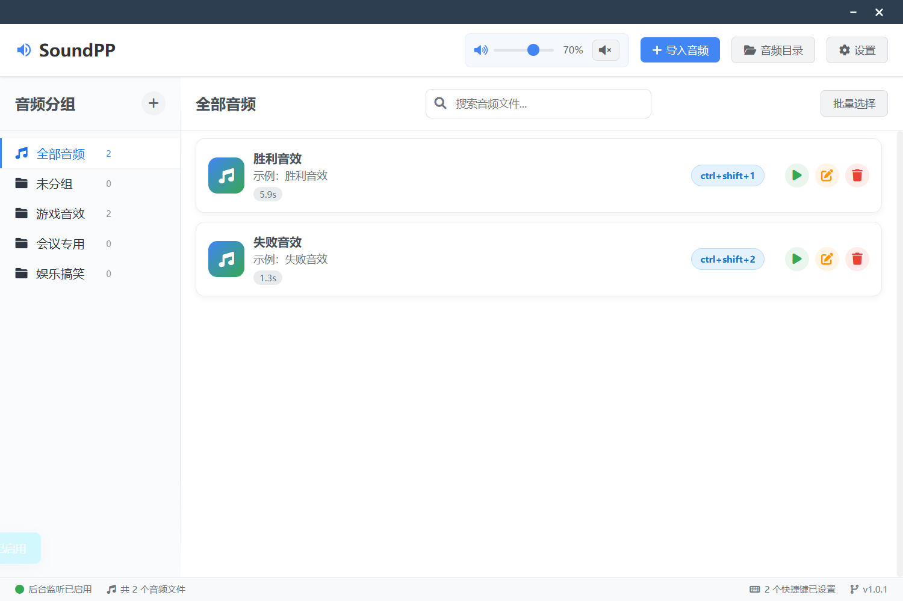

# SoundPP - 音效快捷键管理器

[](./LICENSE)


> 一款基于 Electron 的桌面应用，通过自定义快捷键在任何场景下快速播放音效。适用于主播、播客、演示、直播间控台等场景。

## 目录

- [功能特性](#功能特性)
- [截图预览](#截图预览)
- [快速开始](#快速开始)
- [安装与运行](#安装与运行)
- [构建与打包](#构建与打包)
- [使用说明](#使用说明)
- [支持的音频格式](#支持的音频格式)
- [数据与配置存储位置](#数据与配置存储位置)
- [项目结构](#项目结构)
- [常见问题](#常见问题)
- [开发与贡献](#开发与贡献)
- [许可证](#许可证)

## 功能特性

- 🎵 **全局快捷键播放**：即使应用不在前台，也能通过快捷键触发播放
- 📁 **便捷导入**：拖拽或文件选择导入常见格式音频
- ✂️ **基础剪辑**：内置简单切片输出（WAV），快速生成片段
- 📂 **分组管理**：创建、重命名、排序、统计，支持分组 ZIP 导入/导出
- 📝 **元数据**：为音频设置名称、描述、所属分组、快捷键
- ⌨️ **全局静音切换**：支持为静音功能单独设置快捷键
- 💾 **持久化**：音频库与分组自动保存，重启后恢复
- 🌐 **跨平台**：Windows / macOS / Linux

## 截图预览




## 快速开始

```bash
# 安装依赖
npm install

# 开发模式启动（带调试开关）
npm run dev

# 普通启动
npm start
```

## 安装与运行

从 GitHub Releases 下载对应平台的安装包或便携版，或自行本地构建：

```bash
# Windows（安装包 + 便携版）
npm run build:win

# macOS（dmg）
npm run build:mac

# Linux（AppImage）
npm run build:linux

# 或根据当前平台打包
npm run dist
```

打包产物位于 `dist/`：
- Windows: `SoundPP Setup x.y.z.exe`（安装包） / `SoundPP x.y.z.exe`（便携版）
- macOS: `SoundPP-x.y.z.dmg`
- Linux: `SoundPP-x.y.z.AppImage`

## 构建与打包

本项目使用 `electron-builder`：

- 主命令：
  - `npm run dist` 按当前平台打包
  - `npm run build:win` 生成 Windows 安装包与便携版
  - `npm run build:mac` 生成 macOS DMG
  - `npm run build:linux` 生成 AppImage

- 主要依赖：
  - Electron 37.x
  - electron-builder 24.x
  - wavesurfer.js 7.x

## 使用说明

1. 点击工具栏「导入音频」或将音频文件拖入页面
2. 在音频项上点击「编辑」设置名称、分组与快捷键
3. 在左侧分组面板管理分组（添加、重命名、排序、删除）
4. 支持对分组导入/导出 ZIP 以便备份与分享
5. 使用快捷键或点击播放按钮触发播放

## 支持的音频格式

- MP3 / WAV / AAC / OGG（切片输出为 WAV）

## 数据与配置存储位置

发布版会将用户数据（设置、音频库、导入音频切片等）保存在系统用户目录下：
- Windows: `%APPDATA%/soundpp`
- macOS: `~/Library/Application Support/soundpp`
- Linux: `~/.config/soundpp`

## 项目结构

```
soundpp/
├─ assets/            # 应用图标与静态资源
├─ data/              # 数据文件（运行期生成）
├─ sounds/            # 导入或切片生成的音频文件
├─ index.html         # 渲染进程页面
├─ main.js            # 主进程入口
├─ script.js          # 渲染进程逻辑
├─ styles.css         # 样式
└─ package.json       # 脚本与打包配置
```

## 常见问题

- 无法播放音频或无声？
  - 检查音量是否被静音（主界面或系统音量）
  - 设置中选择正确的输出设备
  - 文件路径无效或已移动时，重新导入

- 快捷键注册失败？
  - 确认没有与系统/其他软件冲突的全局快捷键
  - 在设置中重新开启全局快捷键并保存

- 重新导入同名文件未显示？
  - 应用会自动为拷贝到 `sounds` 目录中的重名文件追加编号，列表会立即刷新。

## 开发与贡献

欢迎提交 Issue 与 PR 改进如下方向：

- 波形可视化与更多编辑能力
- 更多格式支持与解码稳定性
- 云同步、分享与插件系统

开发脚本：

```bash
npm run dev   # 开发模式
npm start     # 普通启动
npm run dist  # 打包
```

## 许可证

本项目采用 MIT 许可证发布。详见 `LICENSE` 文件。
